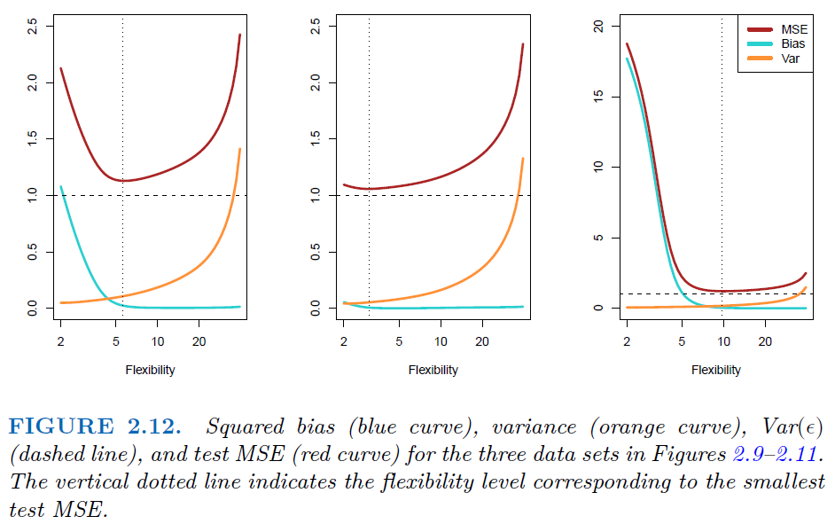

# 2025. 2. 12 수
관심있는 프로젝트 목록 정리
- 음성 명령어 인식 (Voice Command Recognition)
- 음악 장르 분류 (Music Genre Classification)
- 배경 소음 제거 (Background Noise Reduction)
- voice conversion / voice cloning
- audio resolution enhancement

# 2025. 3. 10 월
repository 생성 (sonore)

괜찮은 데이터셋 발견 및 탐색
- [ESC-50: Dataset for Environmental Sound Classification](https://github.com/karolpiczak/ESC-50)
- 2000개의 5초 길이의 소리 데이터. 각 소리는 50 종류의 라벨이 붙어있다.
    - dog, rooster, pig, cow, ...
    - rain, sea waves, crickets, ...
    - ...
- 따라서 이 데이터셋을 분류하는 문제를 생각해볼 수 있다.
- 이 데이터셋을 만든 것으로 추정되는 사람은 Karol Piczak으로 바르샤바 대학교 소속이다. 이 사람은 이 데이터셋으로 [ESC: Dataset for Environmental Sound Classification](https://www.karolpiczak.com/papers/Piczak2015-ESC-Dataset.pdf)라는 논문을 냈다. 이 논문은 2015년에 ACM에서 발표된 논문인 것으로 보인다.
- 10년 전 데이터셋이지만 해당 논문의 피인용횟수가 1895회인 것으로 보아 상당히 중요한 데이터셋인 것으로 보인다. 따라서 이 데이터셋을 가지고 여러가지를 해보는 것이 의미있을 것으로 보인다.

ESC-50 탐색
- 데이터 다운로드
- ./audio의 2000개 소리 중 dog 범주에 속하는 소리 청취
- gitignore 설정
- 해당 논문 다운로드

논문 열람
- 초록

# 2025. 3. 12 수

논문 열람
- 1. Introduction
- 2. The ESC dataset
        - (기타) cross validation 부분에 대한 이해
        - (기타) [4번 주석, havard dataverse](https://dataverse.harvard.edu/dataset.xhtml?persistentId=doi:10.7910/DVN/YDEPUT) 훑기
        - (기타) [5번 주석, notebook](https://github.com/karolpiczak/paper-2015-esc-dataset/blob/master/Notebook/ESC-Dataset-for-Environmental-Sound-Classification.ipynb) 훑기
    - 2.1 ESC-50
        - (본문) labeled data, 2000 sound events, 50 classes (40 sound events for each class)
    - 2.2 ESC-10
        - (본문) labeled data, 10 classes
    - 2.3 ESC-US
        - (본문) unlabeld data, 250000 sound events.
- 3. Sound Classification
    - 3.1 Human classification accuracy
        - (본문) accuracy : ESC-50는 95.7%, ESC-10은 81.3%.
        - (본문) recall : class에 따라 천차만별.
    - 3.2 Baseline machine classification results
        - (기타) MFCC 개요 검색
        - (기타) 관련 책 검색
        - (기타) "Fundamentals of Music Processing: Using Python and Jupyter Notebooks" 다운로드
        - (본문) 결과
            - K-NN              66.7%, 32.2%
            - random forest     72.7%, 44.3%
            - SVM               67.5%, 39.6%
- 4. Summary

# 2025. 3. 13 목

머신러닝 기법 공부
- 목표 : kNN, random forest, SVM을 이해하기 위함. 이것들을 대충은 알고 있지만 완전히 아는 것은 아니므로 공부하려 함.
- 책 : 
[Introduction to Statistical Learning in Python](https://www.statlearning.com/), ISLP로 표기

ISLP
- Preface
- 1 Introduction

## 2 Statistical Learning (ISLP)
2.1 What is statistical learning?
- predictors and responses
$$Y=f(X)+\epsilon\tag{2.1}$$
- Statistical learning refers to a set of approaches for estimating $f$.
- 2.1.1 Why estimate $f$?
    - prediction and inference
    - prediction
        - When a set of inputs $X$ are readily available, but the output $Y$ cannot be easily obtained, $\hat f$ is often treated as a black box.
        $$\hat Y=\hat f(X)\tag{2.2}$$
        - reducible error : The difference between f(X) and \hat Y=\hat f(X). This can be minimized by choosing \hat f closer to  f.
        - irreducible error : The difference between Y and f(X). This cannot be improved further.
        - That is, the error $|Y-\hat Y|$ can be thought of as two errors $|(Y-f(X))+(f(X)-\hat f(X))|$
        - Actually, one can compute $E(Y-\hat Y)^2=[f(X)-\hat f(X)]^2+\text{Var}(\epsilon)$ so that the average of the squared difference between the predicted value $\hat Y$ and the actual value $Y$ is a sum of reducible error and irreducible error.
    - inference
        - When we're interested in understanding the association between $Y$ and $X_1$, $\cdots$, $X_p$, our goal is not necessarily to make predictions for $Y$. Instead, we may wonder about the following questions :
        - Which predictors are associated with the response?
        - What is the relationship between the response and each predictor?
        - Can the relationship between $Y$ and each predictor be adequately summarized using a linear equation, or is the relationship more complicated?
    - This book deals with the problems of (1) prediction, (2) inference, or (3) the mixture of them.
- 2.1.2 How do we estimate $f$?
    - In order to estimate $f$ by $\hat f$ so that $Y=\hat f(X)$, we may use parametric or non-parametric methods.
    - parametric methods
        - parametric methods follow the two steps below.
        - First, we parameterize $f$, that is, we use a set of parameters to formulate a model. For instance, we can construct a linear model $\beta_0+\beta_1X_1+\beta_2X_2+\cdots+\beta_pX_p\tag{2.4}$.
        - Next, we fit or train the model, that is, we find the optimal set of parameters that minimizes the difference (between, say, $Y$ and $\hat Y$).
        - It simplifies the problem of estimating $f$. It reduces to a finite dimensional optimization problem. (pros)
        - The model will usually not match the true unknown form $f$. (cons)
        - The linear fit still appears to do a reasonable job of capturing the relationship between the predictors and the response. (pros)
    - non-parametric methods
        - Non-parametric methods do not make explicit assumptions about the functional form of $f$.
        - They have the potential to accurately fit a wider range of possible shapes for $f$. (pros)
        - A very large number of observations is required in order to obtain an accurate estimate for $f$. (cons)
        - They sometimes accompany the issue of overfitting. (cons)
- 2.1.3 The trade-off between prediction accuracy and model interpretability
    - In general, a model cannot be both flexible and restrictive.
    - The linear regression is an example of restrictive methods where prediction may not be as accurate but we can interpret many things from the model.
    - The thin plate spline is an example of a flexible method where the prediction is quite accurate but there are fewer things to interpret and it has a risk of overfitting.
    - Two specific methods of linear regression : the least squares method and lasso. Both are restrictive, but lasso is more interpretable since it specifies the subset of features that are relevant to the response.
    - GAMs(Generalized additive models) employ some nonlinearity from the linear model, so it is more flexible and less interpretable.
    - Bagging, boosting, support vector machine, neural networks are highly flexible approaches.
- 2.1.4 Supervised versus unsupervised learning
    - Many classical statistical learning methods operate in the supervised learning domain.
    - Unsupervised learning describes a situation in which for every observation $i=1,2,\cdots,n$, we observe a vector of measurements $x_i$, but no associated response $y_i$. In this setting, we may use cluster analysis.
    - For $m\lt n$, if predictor measurement $x_i$ with $1\le i\le m$ has a response measurement $y_i$, but the other predictor measurement $x_i$ with $m+1\le i\le n$ has no response measurement, we refer to this setting as a semi-supervised learning problem.
- 2.1.5 Regression versus classification problems
    - If the response is quantitative (of numerical form), the problem is called regression; if the response is qualitative (of categorical form), the problem is called a classification. But the distinction is not always that crisp.
    - Logistic regression, despite its name, is used in classification problems. K-nearest neighbors and boosting can be used in both cases.
    - In contrast to the response, whether the predictors are qualitative or quantitative is not that important, since we can always code the predictor to be a vector.

# 2025. 3. 17 월

## 2 Statistical Learning (ISLP)
2.1 What is Statistical Learning?
-  A wide range of statistical learning methods will be introduced in this book.
- There is no universal method that works well to all kinds of datasets.
- Hence it is an important task to decide for any given set of data which method produces the best results.

- 2.1.1 Measuring the Quality of Fit.
    - In the regression setting, MSE is the most commonly-used measure for training and test phases both :
    $$\text{MSE} = \frac1n\sum_{i=1}^n\left(y_i-\hat f(x_i)\right)^2\tag{2.5}$$
    - In many cases, the test set might not be available.
    So one might imagine simply selecting a statistical learning method that minimizes the training MSE.
    - Unfortunately, there is a fundamental problem with this strategy : **overfitting**.
    - As the flexibility of the statistical learning method increases, we observe a monotone decrease in the training MSE and a U-shape in the test MSE.
    This is a fundamental property of statistical learning that holds regardless of the particular data set at hand and regardless of the statistical method being used.
    As model flexibility increases, the training MSE will decrease, but the test MSE may not.
    When a given method yields a small training MSE but a large test MSE, we are said to be **overfitting** the data.
    This happens because our statistical learning procedure is working too hard to find patterns in the training data, and may be picking up some patterns that are just caused by random chance rather than by true properties of the unknown function $f$.
    - The flexibility level corresponding to the model with the minimal test MSE can vary considerably among data sets.
    Throughout this book, we discuss a variety of approaches that can be used in practice to estimate this minimum point.
    One important method is cross-validation (Chapter 5), which is a method for estimating the test MSE using the training data.
- 2.2.2 The Bias-Variance Trade-Off
    - For a given test value $x_0$, the expected test MSE can always be decomposed into the squared bias of $\hat f(x_0)$, the variance of $\hat f(x_0)$ and the variance of the error terms $\epsilon$.
    $$\mathbb E\left[(y_0-\hat f(x_0))^2\right]
    =\text{Var}\left(\hat f(x_0)\right)+\text{Bias}\left(\hat f(x_0)\right)^2+\text{Var}(\epsilon).\tag{2.7}$$
    - A proof from [wikipedia](https://en.wikipedia.org/wiki/Bias%E2%80%93variance_tradeoff#Derivation).
        - We have $Y=f(X)+\epsilon$ with $\mathbb E[\epsilon]=0$.
        Let $\text{Var}(\epsilon)=\sigma^2$.
        - For a collected training set $\mathcal D$, we have an approximation $\hat f$ of $f$.
        - We take the expectation $\mathbb E$ in a sense that the training set $\mathcal D$ may vary so that $\hat f$ can have different forms and in the sense that $\epsilon$ may vary.
        - For a given test value $x_0$, we have
            $$\begin{aligned}
            \text{MSE}
            &=\mathbb E\left[(y_0-\hat f(x_0))^2\right]\\
            &=\mathbb E\left[(f(x_0)+\epsilon-\hat f(x_0))^2\right]\\
            &=\mathbb E\left[(f(x_0)-\hat f(x_0))^2\right]
            +2\mathbb E\left[(f(x_0)-\hat f(x_0))\epsilon\right]
            +\mathbb E[\epsilon^2]\\
            &=\mathbb E\left[(f(x_0)-\hat f(x_0))^2\right]
            +2\mathbb E\left[(f(x_0)-\hat f(x_0))\right]\mathbb E[\epsilon]
            +\mathbb E[\epsilon^2]\\
            &=\mathbb E\left[(f(x_0)-\hat f(x_0))^2\right]+\sigma^2.
            \end{aligned}$$
        - The first term of the right hand side becomes
            $$\begin{aligned}
            &\mathbb E\left[\left(f(x_0)-\hat f(x_0)\right)^2\right]\\
            =&\mathbb E\left[\left(f(x_0)
            -\mathbb E[\hat f(x_0)]+\mathbb E[\hat f(x_0)]
            -\hat f(x_0)\right)^2\right]\\
            =&\mathbb E\left[\left(f(x_0)-\mathbb E[\hat f(x_0)]\right)^2\right]
            +2\mathbb E\left[\left(f(x_0)-\mathbb E[\hat f(x_0)]\right)
            \left(\mathbb E[\hat f(x_0)]-\hat f(x_0)\right)\right]
            +\mathbb E\left[\left(\mathbb E[\hat f(x_0)]-\hat f(x_0)\right)^2\right]\\
            =&A+B+C.
            \end{aligned}$$
            where
            $$\begin{aligned}
            A&=\mathbb E\left[\left(f(x_0)-\mathbb E[\hat f(x_0)]\right)^2\right]\\
            &=f(x_0)^2-2f(x_0)\mathbb E[\hat f(x_0)]+\mathbb E[\hat f(x_0)]^2\\
            &=\left(f(x_0)-\mathbb E[\hat f(x_0)]\right)^2
            \end{aligned}$$
            and
            $$
            \begin{aligned}
            \frac B2
            &=\mathbb E\left[\left(f(x_0)-\mathbb E[\hat f(x_0)]\right)
            \left(\mathbb E[\hat f(x_0)]-\hat f(x_0)\right)\right]\\
            &=\mathbb E\left[
                f(x_0)\mathbb E[\hat f(x_0)]
                -f(x_0)\hat f(x_0)
                -\mathbb E[\hat f(x_0)]^2+\mathbb E[\hat f(x_0)]\hat f(x_0)
                    \right]\\
            &=f(x_0)\mathbb E[\hat f(x_0)]-f(x_0)\mathbb E[\hat f(x_0)]
            -\mathbb E[\hat f(x_0)]^2+\mathbb E[\hat f(x_0)]^2\\
            &=0.
            \end{aligned}
            $$
        - Thus, the MSE is now decomposed;
            $$\begin{align*}
            \text{MSE}
            &=\left(f(x_0)-\mathbb E[\hat f(x_0)]\right)^2
            +\mathbb E\left[\left(\mathbb E[\hat f(x_0)]-\hat f(x_0)\right)^2\right]+\sigma^2\\
            &=\text{Bias}\left(\hat f(x_0)\right)^2
            +\text{Var}\left(\hat f(x_0)\right)
            +\text{Var}(\epsilon).
            \end{align*}$$
    - *Variance* and *bias*.
        - Variance refers to the amount by which $\hat f$ would change if we estimated it using a different training data set.
        Since the training data are used to fit the statistical learning method, different training data sets will result in a different $\hat f$.
        But ideally the estimate for $f$ should not vary too much between training sets.
        However, if a method has high variance then small changes in the training data can result in large changes in $\hat f$.
        In general, more flexible statistical methods have higher variance.
        - *Bias* refers to the error that is introduced by approximating a real-life problem, which may be extremely complicated, by a much simpler model.
    - U-shaped MSE :
    As a general rule, as we use more flexible methods, the variance will increase and the bias will decrease.
    The relative rate of change of these two quantities determines whether the test MSE increases or decreases.
    As we increase the flexibility of a class of methods, the bias tends to initially decrease faster than the variance increases.
    Consequently, the expected test MSE declines. However, at some point increasing flexibility has little impact on the bias but starts to significantly increase the variance.
    When this happens the test MSE increases.
    
    - The relationship between bias, variance, and test set MSE is referred to as the **bias-variance trade-off.**
    Good test set performance of a statistical learning method requires low variance as well as low squared bias.
    This is referred to as a trade-off because it is easy to obtain a method with extremely low bias but high variance or a method with very low variance but high bias.
